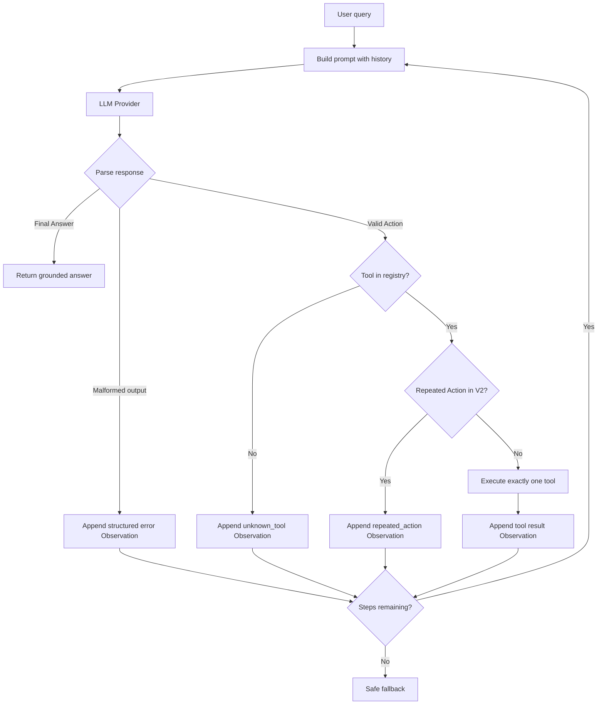

# ReAct Agent Flowchart



Available tool registry:

```text
check_stock → get product price, stock, status, and unit weight
get_discount → validate coupon and return discount percentage
calc_shipping → calculate shipping cost and estimated delivery days
```
