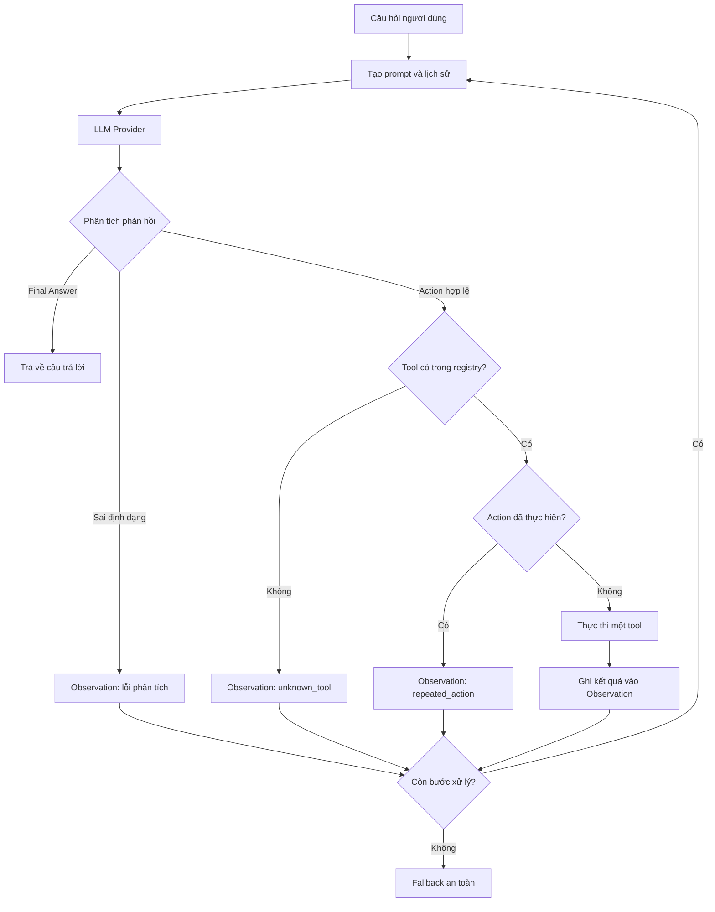

# BÁO CÁO NHÓM: LAB 3 - HỆ THỐNG AGENT THEO TIÊU CHUẨN PRODUCTION

- **Tên nhóm:** K3 Day 03
- **Thành viên:** 

| STT | Họ và tên | Mã học viên |
|-----|-----------|-------------|
| 1 | Nguyễn Hoàng Việt | 2A202601940 |
| 2 | Nguyễn Mạnh Cường | 2A202601361 |
| 3 | Nguyễn Đức Nam Khánh | 2A202601103 |

- **Ngày triển khai và đánh giá:** 2026-07-28
- **Chế độ đánh giá:** Provider mô phỏng xác định, không gọi API bên ngoài

---

## 1. Tóm tắt tổng quan (Executive Summary)

Nhóm đã xây dựng và so sánh hai hệ thống trên cùng năm tình huống kiểm thử:

- **Chatbot baseline:** chỉ gọi mô hình một lần và không có khả năng sử dụng công cụ.
- **ReAct Agent V2:** vận hành theo vòng lặp Thought - Action - Observation,
  có giới hạn số bước và sử dụng các công cụ nghiệp vụ có cấu trúc.

### Kết quả chính

| Hệ thống | Số ca thành công | Tỷ lệ thành công | Tỷ lệ fallback an toàn | Số bước LLM trung bình | Số lần gọi tool trung bình |
|---|---:|---:|---:|---:|---:|
| Chatbot | 2/5 | 40% | 60% | 1,0 | 0,0 |
| Agent V2 | 5/5 | 100% | 0% | 2,4 | 1,4 |

- **Tỷ lệ thành công:** Agent V2 đạt 100%, cao hơn Chatbot 60 điểm phần trăm.
- **Kết quả nổi bật:** Cả hai hệ thống đều trả lời đúng các câu hỏi tĩnh về
  chính sách. Tuy nhiên, Agent giải quyết tốt hơn ba truy vấn động nhờ kiểm tra
  tồn kho, xác thực mã giảm giá và tính phí vận chuyển trước khi trả lời.
- **Đánh đổi:** Agent có độ phức tạp cao hơn và cần nhiều bước gọi LLM/tool hơn
  Chatbot.

Công thức tính:

```text
Tỷ lệ thành công = Số ca thành công / Tổng số ca
Tỷ lệ fallback an toàn = Số ca fallback an toàn / Tổng số ca
Số bước LLM trung bình = Tổng số lần gọi provider / Tổng số ca
Số lần gọi tool trung bình = Tổng số tool đã thực thi / Tổng số ca
```

---

## 2. Kiến trúc hệ thống và công cụ (System Architecture & Tooling)

### 2.1 Cài đặt vòng lặp ReAct

Quy trình xử lý của Agent:

1. Nhận câu hỏi của người dùng và tạo prompt kèm lịch sử xử lý.
2. Gọi `LLMProvider` để nhận một `Action` hoặc `Final Answer`.
3. Phân tích cú pháp đầu ra.
4. Nếu có `Action`, kiểm tra tên tool trong danh sách cho phép và kiểm tra
   action trùng lặp.
5. Thực thi đúng một tool rồi chuyển kết quả thành `Observation`.
6. Đưa Observation vào lịch sử và tiếp tục vòng lặp.
7. Dừng khi nhận `Final Answer` hoặc trả về fallback an toàn khi hết
   `max_steps`.



Sơ đồ độc lập được lưu tại
[`artifacts/react_flowchart.md`](../../artifacts/react_flowchart.md).

### 2.2 Danh sách công cụ

| Tên tool | Định dạng đầu vào | Mục đích sử dụng |
|---|---|---|
| `check_stock` | `{"item_name": "string"}` | Tra cứu giá, số lượng tồn kho, khối lượng và trạng thái sản phẩm |
| `get_discount` | `{"coupon_code": "string"}` | Xác thực mã giảm giá và trả về phần trăm giảm |
| `calc_shipping` | `{"weight": number, "destination": "string"}` | Tính phí và thời gian giao hàng dự kiến |

Cả ba tool đều chỉ đọc hoặc tính toán, không tạo tác dụng phụ. Các lỗi nghiệp
vụ được trả về dưới dạng có cấu trúc như `item_not_found`, `invalid_input` và
`unsupported_destination`, thay vì trả về `None` hoặc làm chương trình dừng.

### 2.3 Các LLM Provider được sử dụng

- **Provider dùng trong đánh giá chính:** `ScriptedProvider`.
- **Các adapter được hỗ trợ trong mã nguồn:** OpenAI, Gemini và Local Provider.

Các provider cùng triển khai giao diện `LLMProvider`. Nhóm sử dụng
`ScriptedProvider` cho lần đánh giá cuối để kết quả có thể tái lập, không phụ
thuộc khóa API, mạng Internet hoặc độ ngẫu nhiên của mô hình. Vì vậy, kết quả
này đánh giá logic điều phối Agent, không đại diện cho hiệu năng của mô hình
trực tuyến.

### 2.4 Phân công nhiệm vụ

| STT | Thành viên | Nhiệm vụ phụ trách | Minh chứng |
|---:|---|---|---|
| 1 | Nguyễn Hoàng Việt | Hoàn thiện parser, executor và vòng lặp ReAct Agent V1 | `src/agent/agent.py` |
| 2 | Nguyễn Hoàng Việt | Phát triển Agent V2 với cơ chế chặn Action trùng lặp | `src/agent/agent_v2.py` |
| 3 | Nguyễn Hoàng Việt | Phân tích failed trace và viết RCA cho lỗi repeated action | `artifacts/traces/repeated_action_*` |
| 4 | Nguyễn Hoàng Việt | Viết kiểm thử vòng lặp Agent và kiểm thử phục hồi V1/V2 | `tests/test_agent_react_loop.py`, `tests/test_agent_recovery.py` |
| 5 | Nguyễn Đức Nam Khánh | Xây dựng ba tool nghiệp vụ và dữ liệu catalog | `src/tools/tools.py` |
| 6 | Nguyễn Đức Nam Khánh | Phát triển Demo Provider và tích hợp các provider | `src/core/demo_provider.py`, `src/core/*_provider.py` |
| 7 | Nguyễn Đức Nam Khánh | Xây dựng giao diện web so sánh Chatbot, Agent V1 và Agent V2 | `scripts/run_ui.py`, `ui/` |
| 8 | Nguyễn Đức Nam Khánh | Xây dựng script đánh giá, telemetry và evaluation artifacts | `scripts/run_lab_evaluation.py`, `artifacts/evaluation/` |
| 9 | Nguyễn Mạnh Cường | Xây dựng Chatbot baseline và safe fallback | `src/chatbot/chatbot.py` |
| 10 | Nguyễn Mạnh Cường | Viết test cho Chatbot và bộ tools | `tests/test_chatbot_baseline.py`, `tests/test_tools.py` |

---

## 3. Telemetry và bảng hiệu năng (Telemetry & Performance Dashboard)

### 3.1 Kết quả đo

| Chỉ số | Chatbot | Agent V2 |
|---|---:|---:|
| Tỷ lệ thành công | 40% | 100% |
| Điểm rubric trung bình | 7,8/12 | 12,0/12 |
| Số bước LLM trung bình | 1,0 | 2,4 |
| Số bước LLM lớn nhất | 1 | 4 |
| Số lần gọi tool trung bình | 0,0 | 1,4 |
| Tổng số lần gọi tool | 0 | 7 |
| Độ trễ trung bình được ghi nhận | 0 ms | 0 ms |
| Token trung bình mỗi tác vụ | Không đo | Không đo |
| Tổng chi phí bộ kiểm thử | Không đo; không gọi API | Không đo; không gọi API |

Giá trị độ trễ 0 ms xuất hiện vì lần chạy sử dụng phản hồi được lập trình sẵn,
không gọi mô hình bên ngoài. Giá trị này **không được xem là độ trễ thực tế**
của hệ thống production. Token, TTFT và chi phí cũng không được đo trong chế
độ này. Dù `PerformanceTracker` đã có trường token, latency và ước tính chi
phí, script đánh giá xác định hiện chưa dùng tracker này để tạo dashboard.

Khi triển khai thật, hệ thống cần thu thập:

- độ trễ tổng và TTFT theo các phân vị P50, P95, P99;
- số prompt token và completion token;
- chi phí theo từng provider và từng yêu cầu;
- tỷ lệ lỗi tool, fallback, timeout và số vòng lặp;
- tỷ lệ action trùng lặp.

Dữ liệu chi tiết của từng ca nằm trong
[`artifacts/evaluation/raw_results.json`](../../artifacts/evaluation/raw_results.json).

Điểm rubric trong kết quả hiện được script gán theo loại ca và việc chuỗi tool
thực tế có khớp `expected_tools` hay không. Vì vậy, điểm 12/12 phản ánh tiêu chí
của bộ đánh giá xác định này; nó chưa thay thế việc chấm ngữ nghĩa độc lập đối
với câu trả lời từ một mô hình trực tuyến.

### 3.2 Kết quả năm ca kiểm thử

| Ca | Kết quả Chatbot | Kết quả Agent V2 | Chuỗi tool của Agent |
|---:|---|---|---|
| 1. Chính sách đổi trả | Đúng | Đúng | Không dùng tool |
| 2. Giờ làm việc | Đúng | Đúng | Không dùng tool |
| 3. Hai iPhone, mã WINNER, giao Hà Nội | Fallback an toàn | Đúng: 45.038.000 VND | `check_stock → get_discount → calc_shipping` |
| 4. Một MacBook, giao Sài Gòn | Fallback an toàn | Đúng: dừng vì hết hàng | `check_stock` |
| 5. Một iPad, mã LEGACY, giao Sài Gòn | Fallback an toàn | Đúng: 18.030.000 VND, không giảm giá | `check_stock → get_discount → calc_shipping` |

Ví dụ trace thành công của ca số 3:

```text
check_stock(iPhone)
→ giá = 25.000.000; tồn kho = 15
get_discount(WINNER)
→ hợp lệ = true; giảm giá = 10%
calc_shipping(0.8, Hanoi)
→ phí vận chuyển = 38.000
Tổng tiền = (25.000.000 × 2) × 0,9 + 38.000
          = 45.038.000 VND
```

Trace đầy đủ được lưu tại
[`multi_step_success_trace.json`](../../artifacts/traces/multi_step_success_trace.json).

---

## 4. Phân tích nguyên nhân gốc - Failure Traces

### Tình huống: Agent thực hiện Action trùng lặp

- **Đầu vào:** `Is the iPhone in stock and what is its price?`
- **Kết quả mong đợi:** Gọi `check_stock` một lần, sau đó trả về
  `Final Answer`.
- **Hiện tượng:** Agent V1 thực thi
  `check_stock({"item_name": "iPhone"})` hai lần mặc dù Observation đầu tiên
  đã chứa giá và số lượng tồn kho.
- **Điểm sai lệch đầu tiên:** Tại bước 2, Agent lặp lại cùng tool và cùng bộ
  tham số thay vì sử dụng Observation đã có.
- **Phân loại lỗi:** Lỗi vòng lặp và điều phối.
- **Nguyên nhân gốc:** Agent V1 chỉ giới hạn `max_steps` nhưng không lưu dấu
  các Action đã thực hiện.
- **Bản sửa nhỏ nhất:** Tạo fingerprint từ tên tool và JSON tham số đã chuẩn
  hóa. Khi gặp fingerprint cũ, Agent trả về Observation có mã
  `repeated_action` mà không thực thi lại tool.
- **Kiểm thử hồi quy:** `tests/test_agent_recovery.py`.

| Phiên bản | Số lần thực thi thật `check_stock` | Kết quả |
|---|---:|---|
| Agent V1 | 2 | Lãng phí một lần gọi tool |
| Agent V2 | 1 | Chặn lần gọi trùng và cung cấp Observation để phục hồi |

Bản sửa giảm 50% số lần thực thi tool trong tình huống lỗi này. Bộ nhớ Action
được tạo riêng cho từng yêu cầu, vì vậy một yêu cầu mới vẫn có thể gọi lại cùng
tool với cùng tham số.

Minh chứng:

- [`repeated_action_failed_trace.json`](../../artifacts/traces/repeated_action_failed_trace.json)
- [`repeated_action_rca.md`](../../artifacts/traces/repeated_action_rca.md)
- [`tests/test_agent_recovery.py`](../../tests/test_agent_recovery.py)

---

## 5. Nghiên cứu ablation và thí nghiệm (Ablation Studies & Experiments)

### Thí nghiệm 1: Agent V1 và Agent V2

- **Thay đổi:** Bổ sung cơ chế ghi nhớ fingerprint của Action trong Agent V2.
- **Các yếu tố được giữ nguyên:** Câu hỏi, prompt, phản hồi của provider, tool
  registry và dữ liệu sản phẩm.
- **Kết quả:** Số lần thực thi `check_stock` giảm từ 2 xuống 1; Agent V2 trả
  Observation `repeated_action` thay vì tiếp tục thực thi hành động thừa.
- **Kết luận:** Giới hạn số bước chỉ giúp vòng lặp kết thúc; phát hiện Action
  trùng lặp còn giúp giảm thao tác dư thừa và cung cấp tín hiệu phục hồi rõ ràng.

### Thí nghiệm 2: Chatbot và Agent

| Loại tình huống | Chatbot | Agent V2 | Hệ thống tốt hơn |
|---|---|---|---|
| Câu hỏi tĩnh | Trả lời đúng, 1 bước | Trả lời đúng, 1 bước | Hòa |
| Mua hàng nhiều bước | Fallback an toàn, không hoàn thành | Thu thập dữ liệu và tính đúng | **Agent V2** |
| Sản phẩm hết hàng | Không xác minh được | Kiểm tra tồn kho và dừng sớm | **Agent V2** |
| Mã giảm giá không hợp lệ | Không xác minh được | Phát hiện mã sai và tính giá không giảm | **Agent V2** |

- **Kết quả:** Chatbot thành công 2/5 ca, trong khi Agent V2 thành công 5/5 ca.
- **Nhận xét:** Agent không tạo lợi ích rõ ràng cho câu hỏi tĩnh, nhưng hiệu quả
  hơn khi câu trả lời cần dữ liệu nghiệp vụ và nhiều bước xử lý.

---

## 6. Đánh giá mức độ sẵn sàng cho production

### Bảo mật

- Chỉ cho phép gọi tool đã đăng ký trong registry.
- Model chỉ đề xuất Action; mã ứng dụng mới có quyền thực thi hàm Python và
  tạo Observation đáng tin cậy.
- Các tool hiện tại không có thao tác ghi dữ liệu.
- Khi thêm write tool, cần xác thực, phân quyền và yêu cầu người dùng xác nhận.
- Cần loại bỏ khóa bí mật và dữ liệu cá nhân trước khi lưu log.

### Guardrails

- Giới hạn số vòng lặp bằng `max_steps`.
- Bắt Action sai định dạng và tên tool không hợp lệ.
- Chuyển lỗi tool thành Observation có cấu trúc.
- Bao bọc ngoại lệ và trả về fallback an toàn.
- Phát hiện Action trùng lặp trong Agent V2.
- Cần bổ sung JSON Schema hoặc Pydantic để kiểm tra nghiêm ngặt tham số.

### Khả năng mở rộng

- Bổ sung timeout, retry có backoff, rate limit và circuit breaker cho provider
  và các tool bên ngoài.
- Lưu trace ID xuyên suốt một yêu cầu để hỗ trợ giám sát và điều tra lỗi.
- Xây dựng dashboard cho token, chi phí, độ trễ, tỷ lệ lỗi và số vòng lặp.
- Thực hiện đánh giá riêng với provider trực tuyến để đo độ trễ và độ biến
  thiên của đầu ra.
- Chuyển sang state machine hoặc LangGraph khi quy trình có nhiều nhánh,
  thao tác ghi hoặc cần con người phê duyệt.

### Kết luận về production readiness

Phiên bản hiện tại phù hợp cho mục đích học tập, demo và kiểm thử logic điều
phối. Hệ thống chưa nên xử lý giao dịch thật cho đến khi có xác thực schema,
kiểm soát quyền, timeout, retry, redaction, giám sát và đánh giá với mô hình
trực tuyến.

---

## Hướng dẫn tái lập

Chạy các lệnh sau từ thư mục gốc của repository:

```powershell
python -m pytest -q -p no:cacheprovider
python scripts/run_lab_evaluation.py
```

Kết quả đã xác minh ngày 2026-07-28:

- **37 kiểm thử passed**.
- **Chatbot:** 2/5 ca thành công, 3 fallback an toàn.
- **Agent V2:** 5/5 ca thành công, trung bình 2,4 bước LLM.
